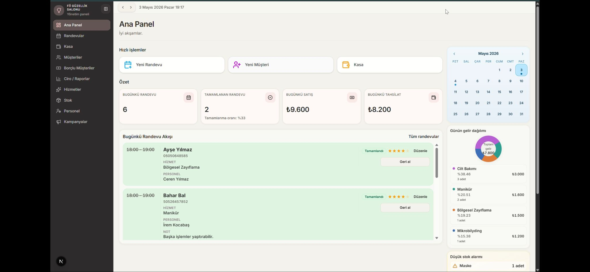
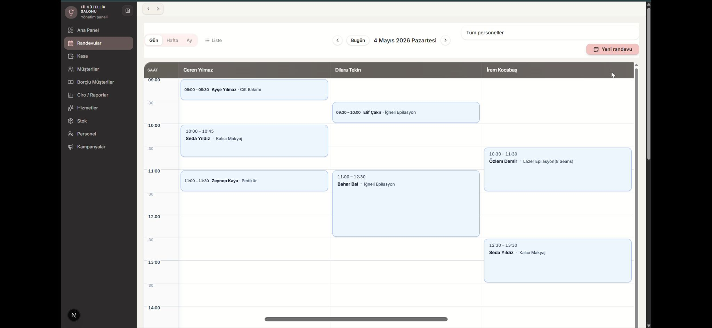
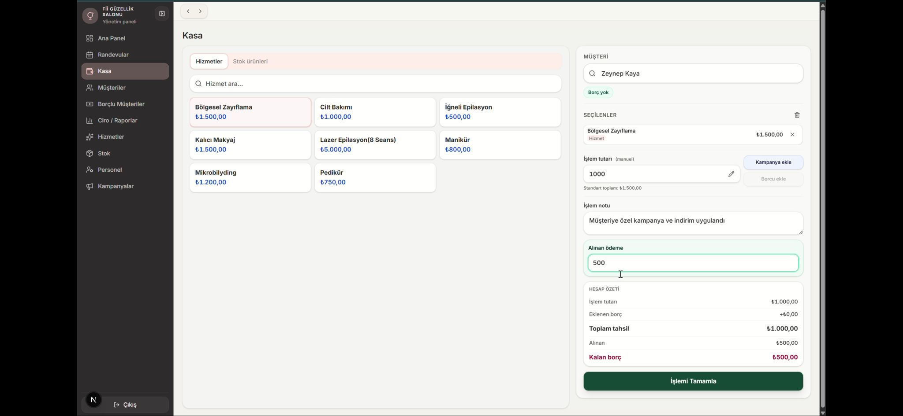
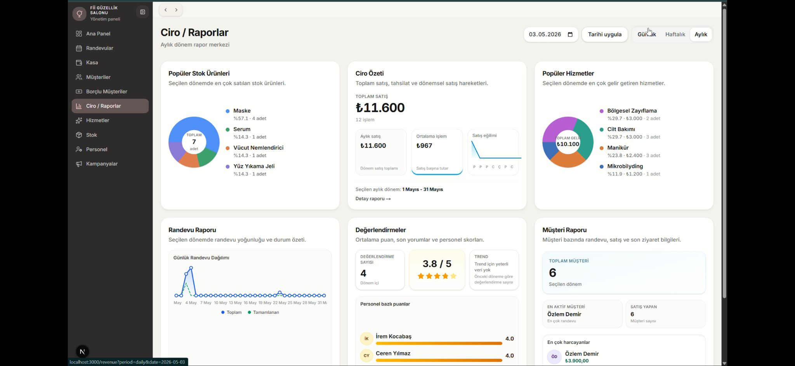
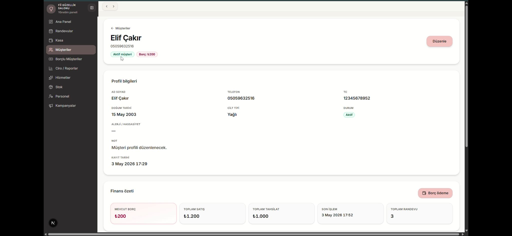

# Fİİ Salon Management Panel

A full-stack salon appointment and business management system developed for a real beauty salon business.

This project was designed and deployed as a production-ready web application focused on appointment scheduling, customer management, cashier operations, debt tracking and business reporting.

## Project Overview

Fİİ Salon Management Panel is a real-world management system built for daily salon operations.  
The application was developed to simplify appointment workflows, financial tracking and customer management within a single centralized platform.

The system focuses on operational simplicity, reliability and long-term maintainability for small business usage.

## Project Status

The application has been completed, deployed and delivered to the client for real business use.

## Core Features

- Appointment scheduling and management
- Customer management system
- Cashier and payment tracking
- Debt management workflow
- Revenue and sales reporting
- Daily operational dashboard
- Staff-based appointment organization
- Service management system
- Real-time business tracking
  
## Project Scope

This project covers the design, development and deployment of a real-world salon management system for a small business.

The scope includes appointment scheduling, customer management, cashier operations, debt tracking, reporting and production deployment infrastructure.

## Feature Highlights

### Appointment Workflow
The system was designed around real salon scheduling operations.  
Appointments are organized with staff-based planning, time management and daily workflow tracking.

### Cashier & Debt Tracking
The application includes cashier operations with integrated payment and debt management workflows.  
Debt balances, partial payments and financial tracking are managed directly within the system.

### Customer Management
Customer profiles include appointment history, payment records and operational notes to simplify long-term customer tracking.

### Reporting & Business Monitoring
The platform provides daily operational insights including appointment statistics, payment tracking and revenue monitoring.

### Production-Oriented Architecture
The application was developed with production deployment and operational stability in mind, including containerized deployment, database backup workflows and reverse proxy infrastructure.

## Tech Stack

### Frontend
- Next.js
- React
- Tailwind CSS

### Backend
- Next.js Server Actions
- Prisma ORM

### Database
- PostgreSQL

### Deployment & Infrastructure
- Docker
- Docker Compose
- Hetzner Cloud VPS
- Cloudflare DNS & Proxy
- Caddy Reverse Proxy

## System Architecture

The application is deployed on a production VPS environment using Docker-based containerization.

Infrastructure includes:

- Cloudflare for DNS management and proxy protection
- Hetzner Cloud VPS hosting
- Docker Compose orchestration
- PostgreSQL database service
- Reverse proxy configuration with automatic SSL
- Automated database backup strategy

## Security & Deployment Notes

This repository is presented as a project showcase and case study.

The original production source code remains private due to:
- client confidentiality,
- production security considerations,
- and infrastructure protection requirements.

## Screenshots
The following screenshots present the main operational modules of the system.

### Dashboard

### Appointment Management

### Cashier & Payment Workflow

### Revenue & Reports

### Customer Profile

> All screenshots use demo data only. No real customer information is displayed.

Screenshots are prepared with demo data only. No real customer information is displayed.

## Contributors

- [Sema Yılmaz](https://github.com/ssema-ylmazz)
- [Hüseyin Boğatekin](https://github.com/huseyinbogatekin)
